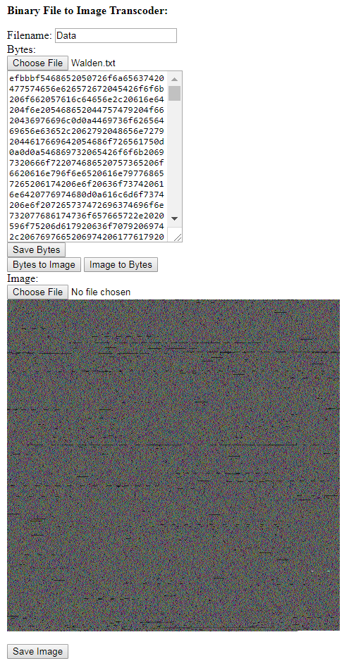

Binary File to Image Transcoder
===============================

The JavaScript program in this repository allows an arbitrary file to be converted to a PNG image and back.  It is meant to overcome overly zealous blocking of certain "dangerous" file types by online services, and to allow inclusion of text resources in JavaScript programs running from the local filesystem.

Running
-------
To run, open the file BinaryFileToImageTranscoder.html in the Source directory.

Building
--------

To transpile the TypeScript code to JavaScript, install the "tsc" command and run it from within the Source directory.  However, since the transpiled JavaScript files are included in the repository, building should not be necessary until the code is changed.
